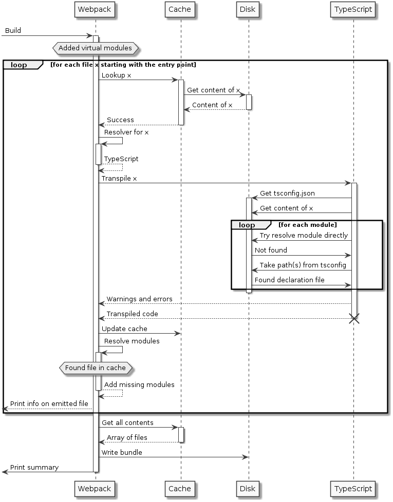

[![Dev dependencies][dependencies-badge]][dependencies]
[![MIT License][license-badge]][license]

# ts-webpack-virtual-resolve

A simple example of how to achieve resolving a virtual module using [TypeScript][typescript] in [Webpack][webpack]!

## Problem Description

There is a range of scenarios where it does not make much sense not to have a file in a fixed directory for being able to resolve it. Let's suppose we have the following situation. We have one module specified as below:

```js
// app.js
const configuration = require('./configuration');

/* ... */

// use configuration.path
```

The configuration module could originate from a file, e.g., *configuration.json*, however, we may have the situation that we have multiple configurations and decide (during compile-time) which one to use. For simplicity, we assume that we have just two files - *configuration-prod.json* and *configuration-test.json*.

Obviously, we already know which one to take, but we don't want to:

- change the reference(s) in all the modules (e.g., going from `require('./configuration')` to `require('./configuration-prod.json')`)
- always copy the file to overwrite *configuration.json* in the right file

The solution would be to change the module resolution dynamically. This seems most elegant, but unfortunately, there is no such function in Webpack that allows us to redirect paths.

Fortunately, the whole thing described above can be solved quite simple. We can pretend to have pre-loaded the source, even though we never touched the path. That way Webpack will always get the correct content from memory, even though no physical path exists. This is what I call a virtual module. Having solved this problem why do we need to have the current repository at all? Is there something left to cover?

Indeed there is - instead of using plain JavaScript (independent of the exact dialect or transformation rules) we now want to use TypeScript. We want to use it to improve code robustness and introduce some contracts that need to be fulfilled between the different modules. The problem with this check origines now from using TypeScript itself. In order to make the check TypeScript needs to perform the module resolution. So even though we inject a virtual module into Webpack, TypeScript does not know about it and will complain.

Now we have two options:

1. We surrounder and declare the given module as "any", such that TypeScript will stop complaining, but also won't do any type checks on the module
2. We try to make it work

Of course this repository exits to show one solution to the problem.

Reminder: This is one way of how the problem occurs (using TypeScript)

```ts
// app.ts
import * as configuration from './configuration';

/* ... */

// use configuration.path
```

## Proposed Solution

In order to get things working we introduce the following dependencies:

* The [awesome-typescript-loader][atsl] to handle the TypeScript files / compilation
* The [virtual-module-webpack-plugin][vmwp] to manipulate the Webpack cache

Additionally, we require a simple helper to generate / update TypeScript declaration files for our virtual modules. These declaration files may be omitted from source control, however, for providing a better user experience (i.e., developer experience) I like to place them in source control. Also as some of these declaration files may not be generated, but rather be written by hand, I tend to treat them all in the same way (thus adding these files to Git seems appropriate to me).

As a prerequisite TypeScript needs to be available in version 2.1 or higher. This allows us to write a *tsconfig.json* like below.

```json
{
  "compilerOptions": {
    "baseUrl": ".",
    "paths": {
      "configuration": ["src/config"]
    }
  }
}
```

The properties `baseUrl` and `paths` go hand in hand. The `paths` property allows us to tell TypeScript about the resolution paths for the named modules. This is quite handy to use a more universal and shorter approach of referencing the virtual module.

Our original source file can therefore be changed:

```ts
// app.ts
import * as configuration from 'configuration';

/* Rest unchanged */
```

The emitted code from TypeScript will still looks as the code above (referencing *src/configuration*). The important part here is that we do not specify the extension (we left that out before, but now we really rely on that). Essentially, we want to abuse the following:

- TypeScript will resolve this to a *configuration.d.ts* file, i.e., some module declaration
- Webpack will resolve this to *configuration.json*, which will be available from the cache

After transpiling with TypeScript (which will work against the pure module declaration) we end up with a JavaScript file similar to the following:

```js
// app.g.js
var configuration = require('./configuration');

// ...
```

Webpack now does its magic and performs the final module resolution, which ends up being roughly equivalent to the following code (excerpt):

```js
// in bundle.js
var configuration = __webpack_require__(id_of_configuration_json);

// ...
```

This way we can inject any code as long as the virtual module is resolved by a physical shim in TypeScript and the virtual, i.e., cached file in Webpack.

The big advantage of this method is that it will also work with IDEs or text editors (e.g. VSCode). The included TypeScript compiler and language services will already work against the declaration file(s) that are specified via the *tsconfig.json*. As a result, the build will not only succeed (or fail) via Webpack, but real problems will already shown beforehand. The disadvantage is, of course, that real files (the declaration files) need to be present on the disk, therefore removing part of the virtual.

If the virtual modules all share the same interface (independent of the generation) then this method makes great sense.

## Available Scenarios

The example repository code contains three different scenarios. All three work similar, but can be distinguished from the details.

1. Resolving a dynamically generated TypeScript file, i.e., the file still needs to be handled from the TypeScript compiler and is only made available to the TypeScript module system via a manually written declaration. Using the TypeScript compiler even this declaration file could be updated automatically.
2. Resolving a JSON file in general. Even though `require` would work here, TypeScript would in general complain that the JSON is not a valid module.
3. Resolving a JSON file from a chosen list (similar to the configuration example outlined in the previous sections).
4. Resolving a generated JSON object. As an example some constants are merged together during compile-time. The result has to be used from the application.

Most importantly, all share the same trick as discussed above: We present TypeScript a declaration file to satisfy it's type checking needs.

## Summary

The following sequence diagram illustrates the build process.



Most notably, the diagram assumes that a declaration file already exists. It is not assuming that an automatic update is available or even mandatory.

The two important parts of the diagram is the resolution of TypeScript to a declaration file and the same resolution from Webpack to the virtual file. The rest is a rough equivalent of the usual Webpack flow in a rather simple form.

## License

MIT License. See the [LICENSE][license] file.

[dependencies-badge]: https://david-dm.org/FlorianRappl/ts-webpack-virtual-resolve/dev-status.svg
[dependencies]: https://david-dm.org/FlorianRappl/ts-webpack-virtual-resolve?type=dev
[typescript]: https://www.typescriptlang.org/
[webpack]: https://webpack.js.org
[atsl]: https://github.com/s-panferov/awesome-typescript-loader
[vmwp]: https://github.com/rmarscher/virtual-module-webpack-plugin
[license-badge]: https://img.shields.io/badge/license-MIT-blue.svg
[license]: https://github.com/FlorianRappl/ts-webpack-virtual-resolve/blob/master/LICENSE